#  AlphaGo board implementation

#### Mitchell Dodson -- CS 430 -- Dr. Menon

In this assignment, I implemented a Go board with alphago-compatible
game states according to the guide by Zhijun Sheng on medium.com.

## Output Screenshots

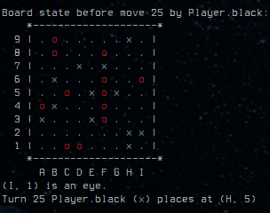

#### Early stages of a bot-vs-bot game

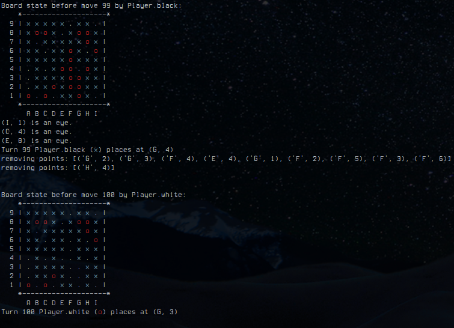

#### Double-capture made by Black in a testing round

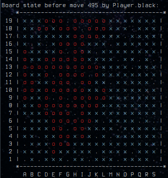

#### Final state of a bot game on a 19x19 board.

Even with zobrist hashes, the combinatorial explosion of conditions
that needed to be checked on each move slowed 19x19 bot games to a
halt on my machine, so most of my testing involved 9x9 boards.

 
 
 
 
 
 
 
 
 
 
 
 

As the number of valid moves decreases in the late game, the
combinatorial possibilities diminish, causing move frequency to
speed back up. The following figure shows the interval of time
between moves by each bot with respect to the total number of moves.

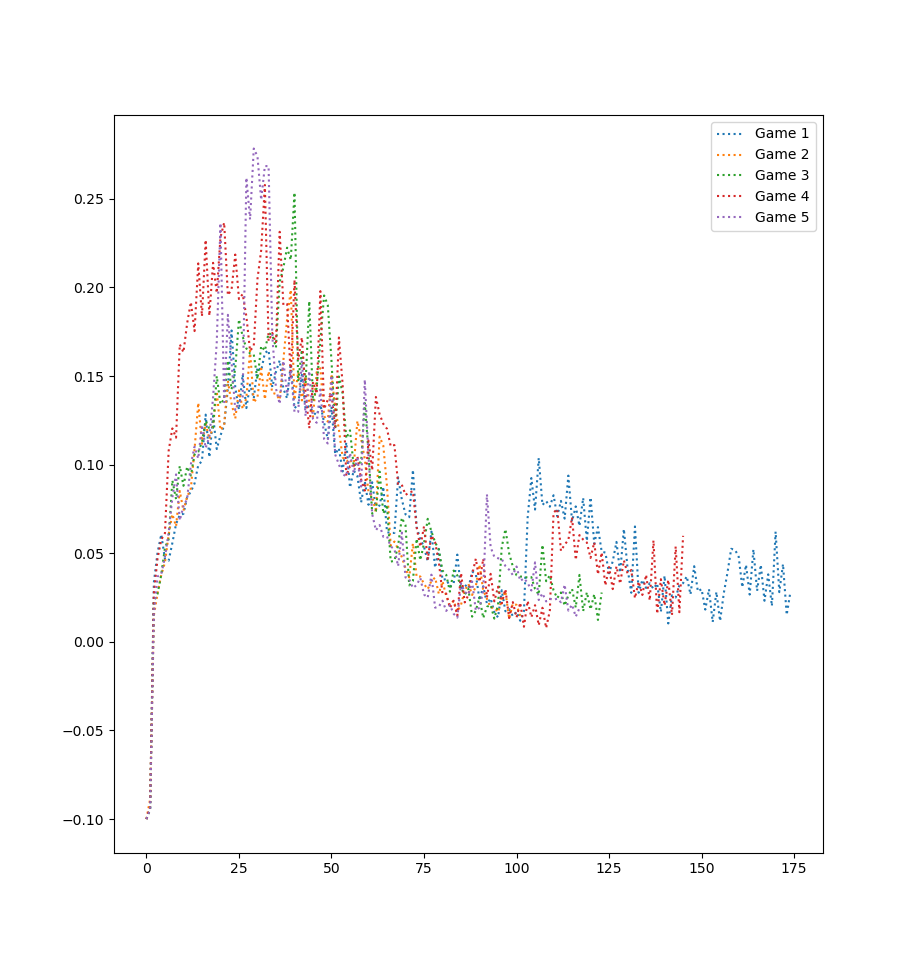

#### Turn time interval wrt move count

 
 
 
 
 
 
 
 
 
 
 

I also implemented a human-vs-bot version of the Go game according to
the guide. The following is a sample of a game where I tried to claim
the entire center of the board (despite the fact this is very
inadvisable when playing Go for victory).

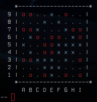

## Analysis of AlphaGo architecture and comparison to human gameplay

Original implementations of AlphaGo by Google's DeepMind team were
initially trained on human gameplay data before being transitioned
to learn by playing against itself. The model is a residual
convolutional network which uses a 19x19x17 binary matrix with a
19x19 board state matrix for each of the players, a 7-state feature
map for each player's history, and an additional 19x19 grid
containing a uniform bit indicating the turn.

The output feature vector of the network is used to generate a value
representation -- a float between zero and 1 -- predicting the
likelihood of winning the game given the current state, and a
policy vector which evaluates the quality of all available moves.

After each real stone placement, the Monte-Carlo tree search
component of AlphaGo selects several of the highest-probability moves
from the policy vector and repeats the process of evaluating each
of the options until ~1,600 hypothetical game states have been tried.
Ultimately, the network chooses the move that optimizes the future
value representation.

AlphaGo is especially effective against humans for a few reasons.
First, Go is a perfect information game (each player has instant
knowledge of the entire game state at every stage, which enables
the network to fully simulate future game states without the
influence of free uncertain parameters. Additionally, Go is a heavily
combinatorial game, with more than 2.081E170 valid game states (for
reference, chess has roughly 4.5E46 valid games states). In games
like this, humans rely heavily on tradition and heuristics. AlphaGo,
on the other hand, is simply able to evaluate vastly more future game
states than humans are capable of. Even in early game stages when
humans are playing standard opening moves, AlphaGo is known to make
stone placement decisions that humans would rarely consider, and
which impact the short-term future states of the game in ways that
seem unpredictable to human players. For example, the latest
iteration of AlphaGo (AlphaGo Zero) was trained entirely using
gameplay against itself -- no human data whatsoever. Initially, it
rediscovered openings (like 4/5 and 3/3) commonly used by humans, but
ultimately diverged from these and discovered abstract and highly
state-sensitive openings that humans rarely if ever used, but which
were shockingly more effective.

## Implementation screenshots

 
 
 
 
 
 
 
 
 
 
 
 
 
 
 
 

## Bot vs Bot

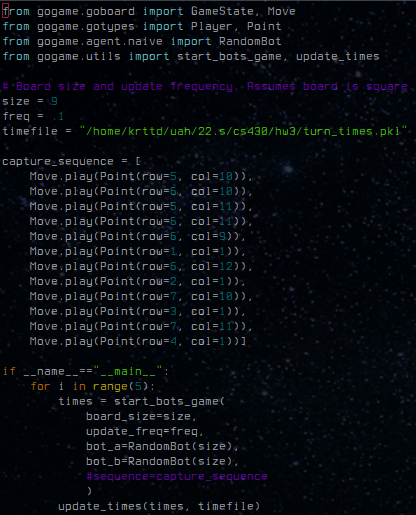

                     
             

## Human vs Bot

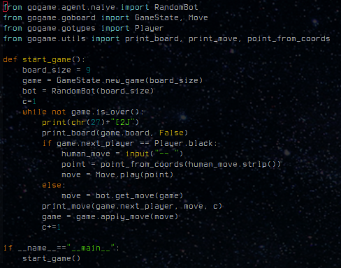

                     
                     
                     

## goboard code

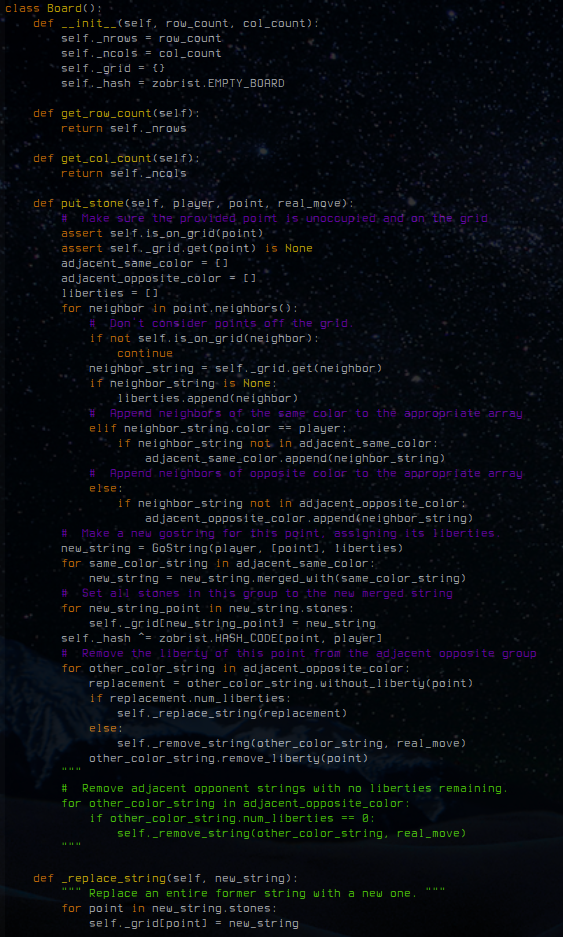

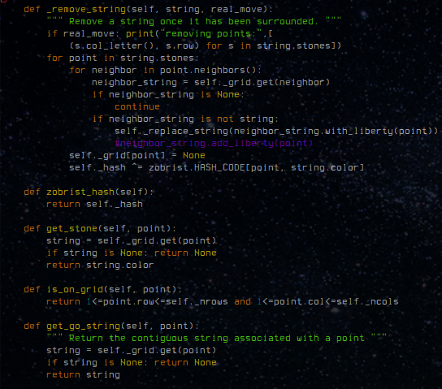

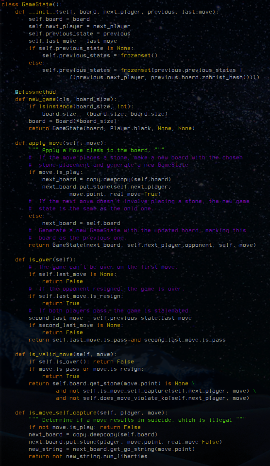

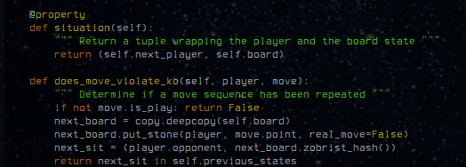

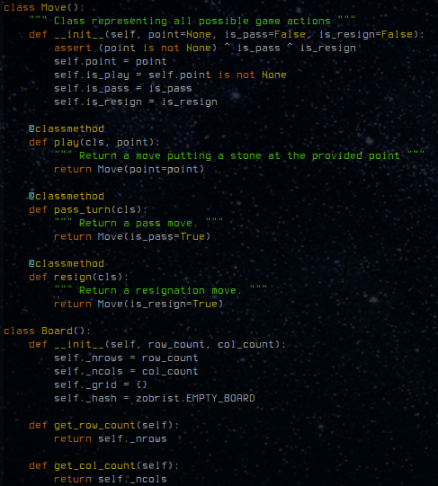

                     
                     
       

## gotypes code

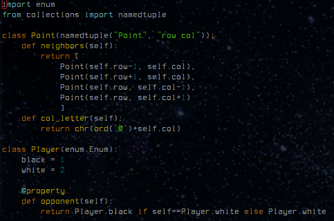

## utils code

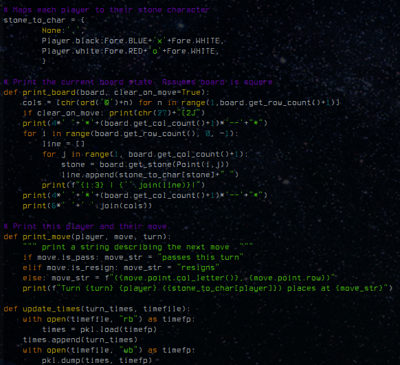

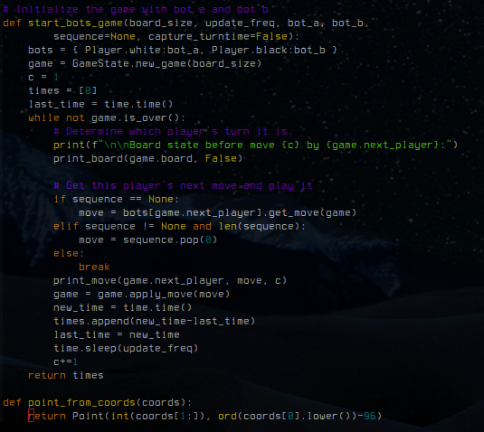

                     

                     

              

## zobrist

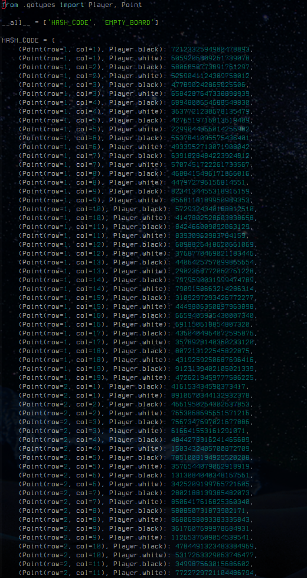
