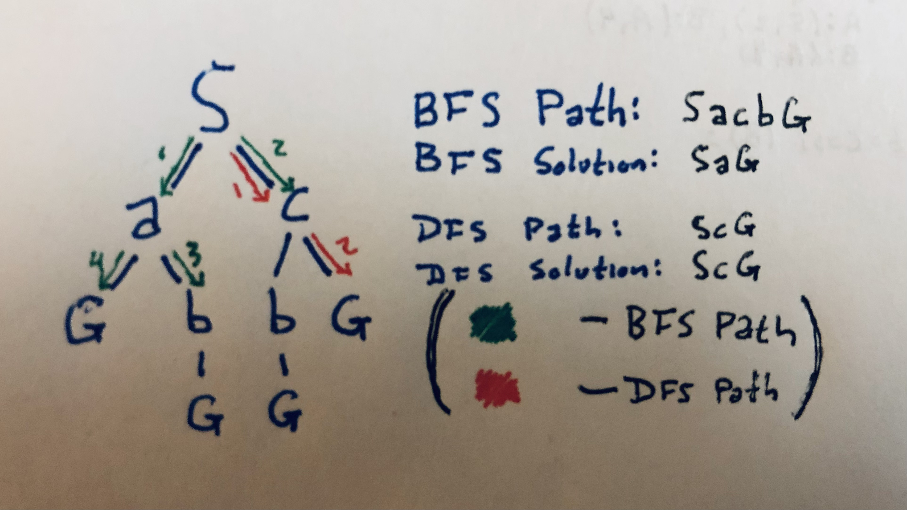
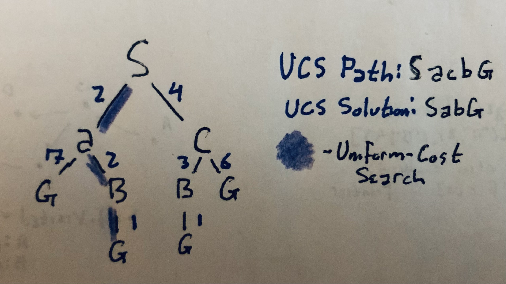

#  Cs 430 Homework 1

#### Mitchell Dodson -- February 27, 2022

<br/>

## Problem 1

<br/>



#### Depth-First and Depth-First Search Tree

<br/>

## Problem 2

### Graph Configuration

My tree program consists of python classes for Nodes, Connections,
and the Graph, which is equipped with methods for all supported
search algorithms. The Breadth-First and Depth-First algorithms
access available frontier nodes like a queue or a stack respectively.

```
connections = (
    Connection(src="S", dst="a", cost=2),
    Connection(src="S", dst="c", cost=4),
    Connection(src="a", dst="b", cost=2),
    Connection(src="a", dst="G", cost=7),
    Connection(src="c", dst="b", cost=3),
    Connection(src="c", dst="G", cost=6),
    Connection(src="b", dst="G", cost=1),
    )
```

There is no meaningful hierarchy for the children of newly-discovered
nodes. If a node has multiple undiscovered children, they will be
added to the queue in the same order they were configured.

<br/>

### Problem 2 Output

Note that the DFS and BFS algorithms ignore the costs configured
with the nodes.

```
  ---==== Breadth-First Search ====---
Active: S
    Queue: [('a', 'S'), ('c', 'S')]
    S->a
Active: a
    Queue: [('c', 'S'), ('b', 'a'), ('G', 'a')k
    a->c
Active: c
    Queue: [('b', 'a'), ('G', 'a'), ('b', 'c'), ('G', 'c')]
    c->b
Active: b
    Queue: [('G', 'a'), ('b', 'c'), ('G', 'c'), ('G', 'b')]
    b->G
Found solution G
Finished in 3 steps with path SaG


  ---==== Depth-First Search ====---
Active: S
    Stack: [('a', 'S'), ('c', 'S')]
    S->c
Active: c
    Stack: [('a', 'S'), ('b', 'c'), ('G', 'c')]
    c->G
Found solution G
Finished in 3 steps with path ScG

```

<br/>

<br/>

<br/>

<br/>

<br/>

<br/>

<br/>

<br/>

<br/>

<br/>

<br/>

<br/>

<br/>

<br/>

<br/>

## Problem 3

<br/>



#### Uniform-Cost Search Search Tree

For problem 3, I created a new search algorithm method for my Graph
class modeled after Dijkstra's Uniform Cost algorithm. This method
holds unexplored nodes in a list of frontier nodes, which is filtered
by least total cost when a new node needs to be selected. New paths
to already-explored nodes are not recorded.

<br/>

### Problem 3 Output

```
  ---==== Uniform-Cost Search ====---
Active: S
    Adding a to frontier with cost 2
    Adding c to frontier with cost 4
    S->a	cost=2
Active: a
    Adding b to frontier with cost 4
    Adding G to frontier with cost 9
    S->c	cost=4
Active: c
    Not adding b to frontier since new cost 7 is greater than ('a', 4)
    Not adding G to frontier since new cost 10 is greater than ('a', 9)
    a->b	cost=4
Active: b
    Updating cost of G in frontier to 5
    b->G	cost=5
Found solution G with cost 5
Finished in 4 steps with path SabG

```

<br/>

<br/>

<br/>

<br/>

## Appendix -- Python Program

<br/>

#### tree\_v3.py

```
class Connection:
    def __init__(self, src:str, dst:str, cost:int=None):
        self._src = src
        self._dst = dst
        self._cost = cost

    @property
    def src(self):
        return self._src
    @property
    def dst(self):
        return self._dst
    @property
    def cost(self):
        return self._cost

    def __str__(self)->str:
        s = f"Connection(src={self._src}, dst={self._dst}, cost={self._cost})"
        return s

    def __repr__(self):
        return self.__str__()

class Node:
    """
    Nodes are named and keep track of the total path cost to reach
    themselves from a parent, and the individual step cost of reaching
    each of their children.
    """
    def __init__(self, name):
        self._name = name
        if len(self._name) != 1:
            raise ValueError(
                f"Node name ({name}) can only be one character.")
        # entries are 2-tuples (name, total path cost to this node)
        self._parents = {}
        # entries are 2-tuples (child name, total path cost to child)
        self._children = {}

    @property
    def name(self):
        return self._name

    def __repr__(self)->str:
        return self.__str__()
    def __str__(self)->str:
        return f"Node(name={self._name}, parents={self._parents},"+
                f"children={self._children})"
```
<br/>

<br/>

<br/>

```
    #  Children are established as soon as the graph loads
    def get_children(self, by_cost:bool=False):
        """
        @:param by_cost Boolean indicating whether to sort by increasing cost.

        Returns the name and cost of all children as a list of 2-tuples
        formatted like ( child name , cost ).
        """
        if not by_cost:
            return self._children.items()
        try:
            return list(sorted(self._children.items(), key=lambda c: c[1]))
        except TypeError as te:  # Raised if there are None values for cost.
            return self._children.items()

    def add_child(self, name:str, cost:int=None):
        """
        @:param name    1-character string name of the child Node.
        @:param cost    cost of traveling to this child.
        """
        self._children.update({name: cost})

    def get_parents(self, by_cost:bool=False):
        """
        @:param by_cost Boolean indicating whether to sort by
                        increasing cost.

        Returns the name of all known parents for this Node along with the
        total path cost of reaching this Node via the provided parent.
        """
        if not by_cost:
            return self._parents.items()
        try:
            return list(sorted(self._parents.items(), key=lambda p:p[1]))
        except TypeError as te:  # Raised if there are None values for cost.
            return self._parents.items()

    def add_parent(self, name:str, cost:int=None):
        """
        @:param name    ID of the new parent node
        @:param cost    Total cost to reach this node via the parent.

        A parent should only be added when this Node is explored or
        when a parent's route has been shortened.
        """
        if name in self._parents.keys():
            #  If the parent already exists but the new cost is lower,
            #  update the cost in the parent dictionary.
            if cost < self._parents[name]:
                self._parents[name] = cost
        else:
            self._parents.update({name:cost})

```

<br/>

<br/>

```


class Graph:
    def __init__(self, connections:tuple):
        self._nodes = {}
        self._connections = {}
        self._paths = {}
        self._frontier = {}
        self._queue = []

        for c in connections:
            #  Make a dict entry for source nodes and list their connections.
            if c.src in self._connections.keys():
                self._connections[c.src].append(c)
            else:
                self._connections.update({c.src:[c]})
            #  Create entries for nodes that are mentioned as destinations
            #  even if they aren't a different node's parent.
            if c.dst not in self._connections.keys():
                self._connections.update({c.dst:[]})

        # Make a dictionary of all Nodes in the graph and add their children.
        for n in self._connections.keys():
            self._nodes.update({n:Node(n)})
            for c in self._connections[n]:
                self._nodes[n].add_child(name=c.dst, cost=c.cost)

        #  Add the parents to the Nodes
        for k in self._connections.keys():
            for c in self._connections[k]:
                self._nodes[c.dst].add_parent(k, c.cost)

    def do_bfs(self, start:str, goal:str):
        """
        @:param start   ID of Node to start with.
        @:param goal    ID of Node to find.

        Perform Breadth-First Search on this Graph
        """
        self._paths = {}
        self._queue = []
        current = start
        self._paths.update({start:(None, None)})
        while current != goal:
            print(f"Active: {current}")
            children = self._nodes[current].get_children()
            self._queue += [ (c[0], current) for c in children ]
            print(f"    Queue: {self._queue}")
            dst, src = self._queue.pop(0)
            while dst in self._paths.keys():
                dst, src = self._queue.pop(0)
            self._paths.update({dst:(src, None)})
            print(f"    {current}->{dst}")
            current = dst

        print(f"Found solution {current}")
        self._print_path(current)

```

<br/>

<br/>

```
    def do_dfs(self, start:str, goal:str):
        """
        @:param start   ID of Node to start with.
        @:param goal    ID of Node to find.

        Perform Depth-First Search on this Graph
        """
        self._paths = {}
        self._queue = []
        current = start
        self._paths.update({start:(None, None)})
        while current != goal:
            print(f"Active: {current}")
            children = self._nodes[current].get_children()
            self._queue += [ (c[0], current) for c in children ]
            print(f"    Stack: {self._queue}")
            dst, src = self._queue.pop(len(self._queue)-1)
            while dst in self._paths.keys():
                dst, src = self._queue.pop(len(self._queue)-1)
            self._paths.update({dst:(src, None)})
            print(f"    {current}->{dst}")
            current = dst

        print(f"Found solution {current}")
        self._print_path(current)

```

<br/>

<br/>

<br/>

<br/>

<br/>

<br/>

<br/>

<br/>

<br/>

<br/>

<br/>

<br/>

<br/>

<br/>

<br/>

```

    def do_ucs(self, start:str, goal:str):
        """
        @:param start   ID of Node to start with.
        @:param goal    ID of Node to find.

        Perform Dijkstra's Uniform Cost Search algorithm on the graph.
        """
        self._paths = {}
        self._frontier = {}
        current = start
        self._paths.update({start:(None,0)})
        while current != goal:
            print(f"Active: {current}")
            children = self._nodes[current].get_children(by_cost=True)
            for name,cost in children:
                #  Skip child nodes that have already been explored.
                if name in self._paths.keys():
                    print(f"    Skipping known child {name}")
                    continue

                #  If the child Node isn't in the frontier, add it with the
                #  cost from this parent.
                if name not in self._frontier.keys():
                    cost = cost+self._paths[current][1]
                    print(f"Adding {name} to frontier with cost {cost}")
                    self._frontier.update(
                            {name:(current, cost)})

                #  If the child Node is in the frontier already but the new
                #  total path cost is less than the previous frontier cost for
                #  the same node, replace the child's source and cost with
                #  those calculated from the new parent..
                elif cost+self._paths[current][1] < self._frontier[name][1]:
                    new_cost = cost+self._paths[current][1]
                    print(f"Updating cost of {name} in frontier to {new_cost}")
                    self._frontier[name] = (current,
                            cost+self._paths[current][1])
                else:

                    print(f"    Not adding {name} to frontier since"+
                        "new cost {cost+self._paths[current][1]} is"+
                        "greater than old cost"+
                        "{self._frontier[name]}")

            cost_list = sorted(self._frontier.items(),
                    key=lambda a:a[1][1])
            #print("   ",cost_list)
            if len(cost_list) == 0:
                raise ValueError("No paths found to goal!")
            cheapest = cost_list[0]
            dst = cheapest[0]
            src, cost = cheapest[1]
            print(f"    {src}->{dst}\tcost={cost}")
            #print(f"    Known:    {self._paths}")
            #print(f"    Frontier: {self._frontier}")
            self._paths.update({dst:(src,cost)})
            self._frontier.pop(dst)
            current = dst

        print(f"Found solution {current} with cost {cost}")
        self._print_path(current)
```

<br/>

```
    def _print_path(self, node:str):
        """ Prints the currently-cheapest path to this node """
        if node not in self._paths.keys():
            raise ValueError(
                    f"Provided node {node} has not yet been found!")
        c = self._paths[node]
        count = 1
        path = node
        while c[0] != None:
            count += 1
            path = c[0]+path
            c = self._paths[c[0]]

        print(f"Finished in {count} steps with path {path}\n")

    def _rec_cost(self, name:str):
        """
        @:param name    String name of explored Node to get the
                        recursive least cost of the path to.

        Recursively finds the cost to a given explored node from the
        source.
        """
        tmp_parent, tmp_cost = self._paths[name]
        if tmp_parent == None:
            return tmp_cost
        else:
            parent, cost = self._paths[name]
            return cost+self._rec_cost(parent)


if __name__=="__main__":
    connections = (
        Connection(src="S", dst="a", cost=2),
        Connection(src="S", dst="c", cost=4),
        Connection(src="a", dst="b", cost=2),
        Connection(src="a", dst="G", cost=7),
        Connection(src="c", dst="b", cost=3),
        Connection(src="c", dst="G", cost=6),
        Connection(src="b", dst="G", cost=1),
        )
    g = Graph(connections)
    print("\n  ---==== Breadth-First Search ====---")
    g.do_bfs("S", "G")
    print("\n  ---==== Depth-First Search ====---")
    g.do_dfs("S", "G")
    print("\n  ---==== Uniform-Cost Search ====---")
    g.do_ucs("S", "G")
```
